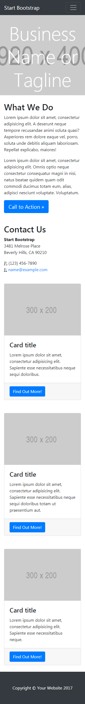

# Reto : Mi página 
---
## Objetivo :
En este reto, vamos a realizar una página a nuestro gusto.

El diseño lo puedes realizar como mejor te parezca, pero debes mantener la estructura de la página y debes realizarlo con un grid (cualquiera pero que no sea un framework como Bootstrap o Materialize). La estructura de la página es la siguiente:

## Especificaciones 

Para este reto se trabajo el tema de Social Media y el resultado es el siguiente.
El uso de grillas es muy importante para la maquetación , de igual manera el manejo de media querys ayudaron a la visibilidad del icono de menú cuando se desea abrir la web en dispositivos moviles.

